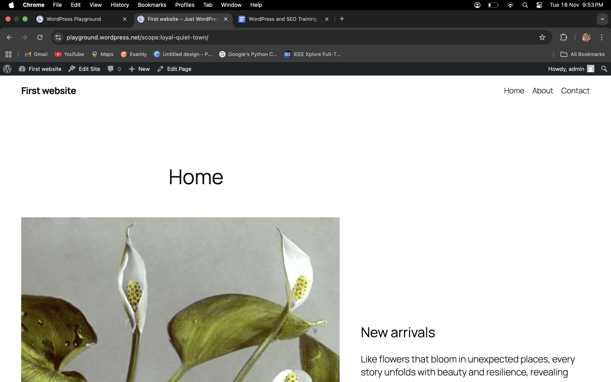
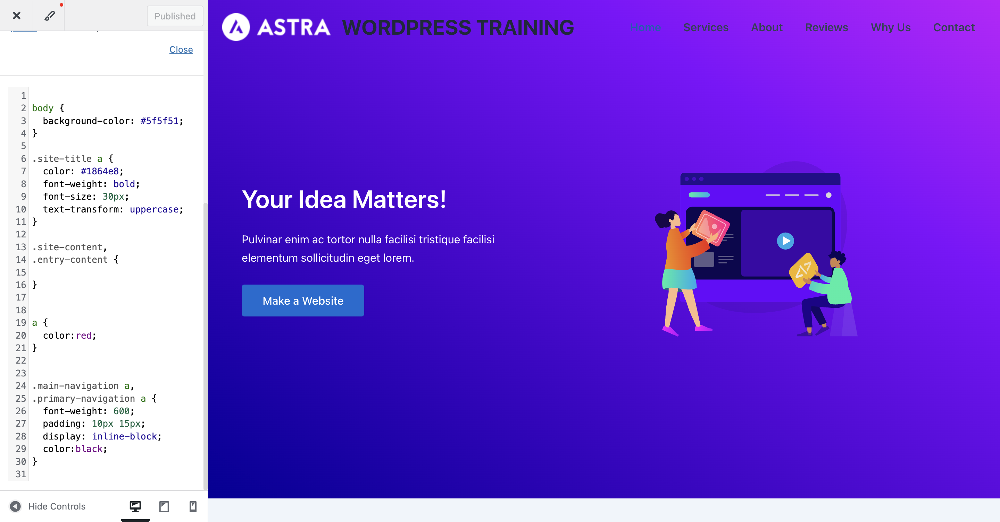
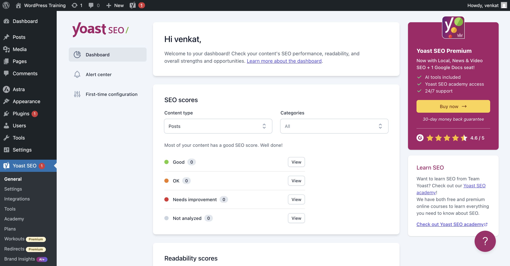
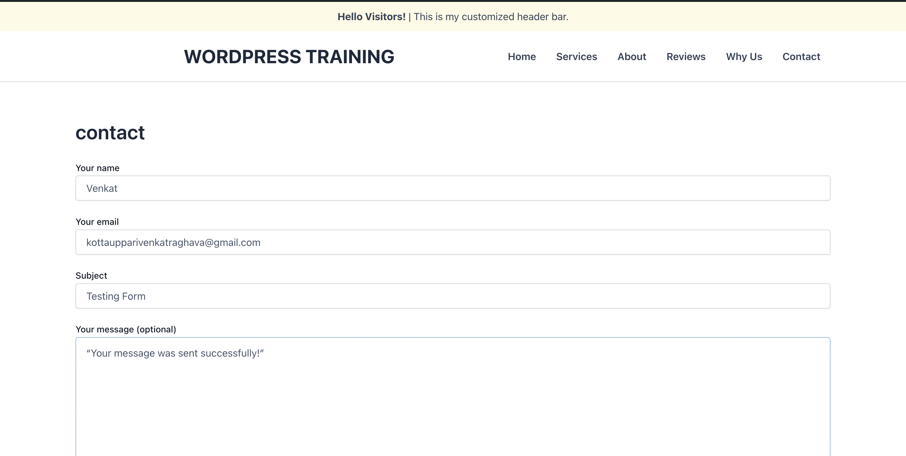

# WordPress & SEO Training – Hands-on Tasks

This repository documents all practical tasks completed during the WordPress and SEO Training program.

---

## Day 1 – WordPress Basics

### ✔ Hands-on Task 1: Explore the Dashboard
- Explored Posts, Pages, Media
- Viewed Appearance → Themes
- Viewed Plugins section

### ✔ Hands-on Task 2: Configure Basic Settings
- Updated Site Title and Tagline
- Set timezone to India (Telangana)
- Changed Permalinks to "Post Name"
- Managed reading and discussion settings

### ✔ Hands-on Task 3: Create First Pages
Created the following pages:
1. **Home**
2. **About**
3. **Contact**

> Screenshots available in

## Home Page Screenshot

## Day 2 – Themes and Plugins

### ✔ Customized Theme
- Changed colors and layout
- Modified header and footer
- Added custom CSS

### ✔ Installed Plugins
1. Yoast SEO  
2. Contact Form 7  

### ✔ Created a Contact Form
- Added Contact Form 7 shortcode inside Contact page

