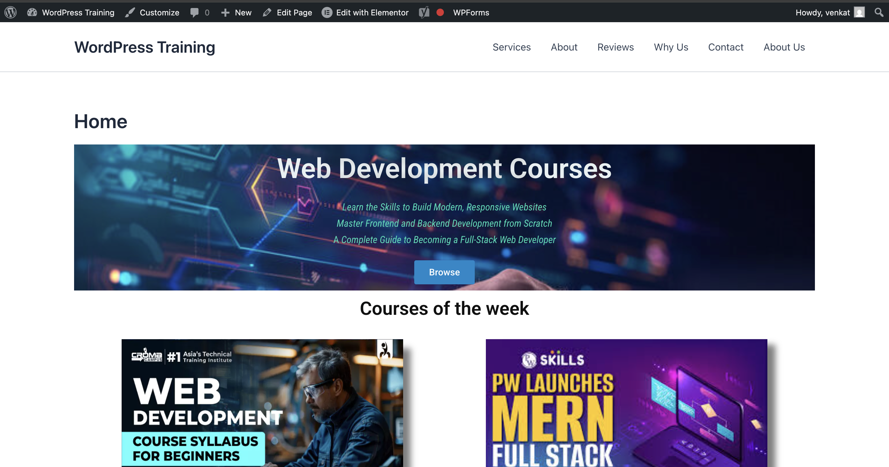

# WordPress & SEO Training – Hands-on Tasks

This repository documents all practical tasks completed during the WordPress and SEO Training program.

---

## Day 1 – WordPress Basics

### ✔ Hands-on Task 1: Explore the Dashboard
- Explored Posts, Pages, Media
- Viewed Appearance → Themes
- Viewed Plugins section

### ✔ Hands-on Task 2: Configure Basic Settings
- Updated Site Title and Tagline
- Set timezone to India (Telangana)
- Changed Permalinks to "Post Name"
- Managed reading and discussion settings

### ✔ Hands-on Task 3: Create First Pages
Created the following pages:
1. **Home**
2. **About**
3. **Contact**

> Screenshots available in

## Home Page Screenshot

## Day 2 – Themes and Plugins

### ✔ Customized Theme
- Changed colors and layout
- Modified header and footer
- Added custom CSS

### ✔ Installed Plugins
1. Yoast SEO  
2. Contact Form 7  

### ✔ Created a Contact Form
- Added Contact Form 7 shortcode inside Contact page

## Day 3 – Page Builders & Design

 ### Topics Covered

Introduction to Elementor and Gutenberg

Designing pages using drag-and-drop editors

Adding forms, galleries, and dynamic content

## Task: Create a Homepage Using Elementor 

Steps:

Go to Pages → Add New → Edit with Elementor

Create sections:

Home section (Heading + Text + Button + Background image)

About section (Image + Text)

Services section (3 columns with icons)

Gallery section

Contact form section (CF7 or Elementor Pro)

Make the page responsive (mobile/tablet)

Publish the page

Set it as homepage: Settings → Reading → Homepage

## Files in This Folder

## Day 4 — On-Page SEO & Blog Optimization

Today I learned how to write and optimize a blog using on-page SEO techniques. This included keyword research, content formatting, adding meta descriptions, alt text, and internal links to improve ranking and readability.

### Hands-on Tasks: Write and optimize the first blog.

Keyword research using Ubersuggest

Wrote and formatted a blog with proper headings (H1, H2, H3)

Added meta description & relevant keywords

Included internal and external links

Used alt text for images

## Files in This Folder

### Day 5 — Off-Page SEO & Google Analytics

## Goals

Learn backlink building basics

Publish Blog #2 and Blog #3

Integrate and verify Google Analytics (GA4)

## Tasks Checklist

 Write and optimize Blog #2

 Write and optimize Blog #3

 Publish both blogs on WordPress

 Add internal links and images

 Install and connect Google Analytics (GA4)

 Verify tracking with a realtime screenshot

 Create basic backlink outreach plan

## Tools Used

Google Analytics

WordPress + Site Kit Plugin

Google Analytics

## Files in This Folder

